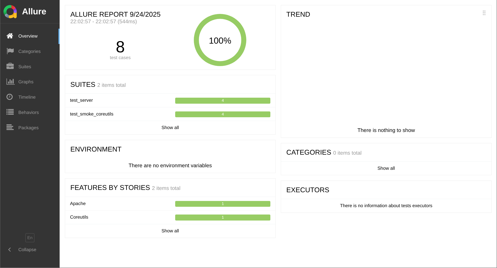

# Apache Testing Project (target + agent)

Автоматизированная проверка Apache2 (статическая страница) в Docker. Проект разворачивает два контейнера:

* **target** — Debian + Apache2 + SSH, далее отдаёт `/index` и принимает SSH-подключения.
* **agent** — Python + pytest; подключается к target по SSH и выполняет проверки (запущен ли Apache, ошибки в логах за N минут, корректная отдача `/index`, 404 на несуществующие страницы).

> По умолчанию окно проверки логов — **10 минут**.

---

## 1. Зависимости (что должно быть установлено)

1. **Docker** (20.10+)
2. **Docker Compose v2**

* Рекомендуемая команда: `docker compose ...` (Compose v2 как плагин Docker).
* Альтернатива (если стоит отдельный бинарник): `docker-compose ...`.

Проверка:

```bash
docker --version
docker compose version    
# или docker-compose --version
```

---

## 2. Структура проекта

```
.
├── docker-compose.yml
├── target/
│   ├── Dockerfile
│   └── entrypoint.sh
└── agent/
    ├── Dockerfile
    └── tests/
        ├── test_server.py
        └── test_smoke_coreutils.py   # смок‑тесты tar/ln
```

> **Глобальная идея:** Два сервиса — `target` (Apache) и `agent` (pytest). Всё разнесено по папкам.

---

## 3. Запуск проекта

### 3.1. Сборка образов

```bash
docker-compose build
```

### 3.2. Запуск только target (Apache)

```bash
docker-compose up -d target
```

Проверьте, что веб-сервер доступен: откройте [http://localhost:8080](http://localhost:8080)
Должна быть страница с текстом: `Hello from Apache container!! :3`

Проверка доступности вручную:

```bash
curl -i http://localhost:8080/index
```

### 3.3. Запуск тестов (`agent`)

```bash
docker-compose run --rm agent
```

Тесты подключатся к target по SSH и выведут отчёт в консоль.

---

## 4. Конфигурация (переменные окружения)

По умолчанию `agent` использует следующие значения, заданные в `docker-compose.yml`:

* `TARGET_HOST=target`
* `TARGET_USER=root`
* `TARGET_PASS=rootpass`
* `TARGET_SSH_PORT=22`

Изменить можно двумя способами:

1. Временно при запуске:

```bash
docker compose run --rm -e TARGET_HOST=my-target -e TARGET_PASS=secret agent
```

2. Отредактировав `docker-compose.yml` (секция `environment` у сервиса `agent`).

> **Безопасность:** В учебном проекте разрешён вход по паролю root внутри приватной сети Docker.
> В проде так не делают (вот прям ваще!) — используйте ключи и отключайте `PermitRootLogin`/PasswordAuth!!!

---

## 5. Остановка и очистка

Остановить сервисы:

```bash
docker-compose down
```

Удалить только контейнер агента после разового прогона делает флаг `--rm`.
Логи target:

```bash
docker compose logs -f target
```

---

## 8. Что именно проверяют тесты

1. Apache-процесс запущен.
2. В `error.log` нет ошибок за последние 10 минут.
3. `/index` отдаёт `HTTP 200` и содержит сообщение.
4. Несуществующая страница возвращает `HTTP 404`.
5. `tar` установлен и работает: создаётся временный файл, архивируется `tar -cf`, распаковывается `tar -xf`, сверяется побайтно, артефакты удаляются.
6. `ln` установлен и работает: проверяются символическая ссылка (`ln -s` + `test -L` + `cmp -s`) и жёсткая ссылка.

---

## 9. Смок‑тесты системных утилит (`tar`, `ln`)

* **Как запускаются**: вместе с остальными тестами командой

  ```bash
  docker-compose run --rm agent
  ```
* **Что именно делают**:

  * `tar`: в `/tmp` создаётся временная директория и файл, далее архивирование `tar -cf`, распаковка `tar -xf` в другую директорию и побайтное сравнение `cmp -s`. В конце - очистка временных артефактов.
  * `ln`: создаётся исходный файл; проверяется символическая ссылка (`ln -s` + проверка через `test -L` и `cmp -s`) и жёсткая ссылка (`ln` без `-s`, проверка содержимого и числа жёстких ссылок через `stat`).

## 10. Credentials для подключения к target

Проект поддерживает настройку реквизитов доступа к проверяемому серверу (**target**) через переменные окружения. Используется **парольная аутентификация по SSH**.

### Что настраивается

* `TARGET_HOST` — хост/имя сервера (в локалке это имя контейнера: `target`)
* `TARGET_SSH_PORT` — порт SSH (по умолчанию `22`)
* `TARGET_USER` — пользователь (по умолчанию `root`)
* `TARGET_PASS` — пароль (по умолчанию `rootpass`)

### Как задать значения

Создайте локальный файл `.env` на основе примера:

```bash
cp .env.example .env
```

> В репозитории хранится **`.env.example`** (образец). Реальный `.env` можно не коммитить — он для ваших локальных значений.
> В учебном стенде пароль `root/rootpass` используется только во внутренней docker-сети, наружу порт 22 не пробрасывается.

## 11. Запуск против внешнего target

Тесты можно запускать не только против локального контейнера `target`, но и против внешнего сервера (VPS/хост),
если на нём доступен SSH и установлен Apache2.

**Требования к внешнему серверу:**

* доступ по SSH (порт по умолчанию 22) и валидные `USER`/`PASS`;
* установлен и запущен Apache2 (Debian/Ubuntu), логи по умолчанию: `/var/log/apache2/error.log`;
* доступны утилиты: `curl`, `tar`, `ln`.

**Пример запуска без локального `target`:**

```bash
docker compose run --rm --no-deps \
  -e TARGET_HOST=<ip или домен> \
  -e TARGET_USER=<user> \
  -e TARGET_PASS=<pass> \
  agent
```

> Ключ `--no-deps` не будет поднимать локальный контейнер `target`. Все проверки выполняются по SSH **на внешнем сервере** (процессы, логи, `curl http://localhost/...`).


## 12. Allure‑отчёт

После прогона тестов результаты лежат в `./reports/allure-results`.

### Allure CLI на хосте

Если CLI ещё не установлен:

```bash
sudo apt-get update && sudo apt-get install -y nodejs npm

sudo npm i -g allure-commandline

allure --version

# открыть отчёт (поднимет локальный веб‑сервер и откроет браузер)
allure serve ./reports/allure-results

# (опционально) сгенерировать HTML
allure generate ./reports/allure-results -o ./reports/allure-report --clean

# затем откройте файл ./reports/allure-report/index.html
```


